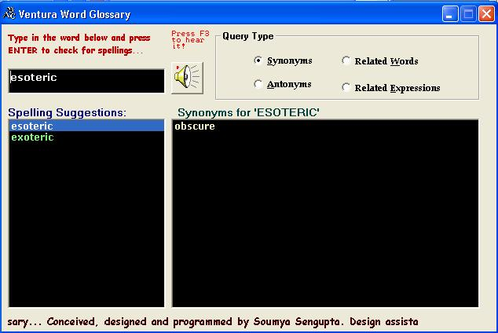



## Talking Dictionary II

### Description

This is an english dictionary cum spell-checker, that uses OLE Automation to access MS Word's in-built spell-checker and dictionary. It also implements TTS (Text to Speech) facility with the help of XVoice.dll by Microsoft.
 
### More Info
 
(1) Please DO READ the Readme.txt file first.

(2) Run the Group1.VBG file.

             |
---                |---
**Submitted On**   |2005-08-29 01:02:22
**By**             |[Soumya Sengupta](https://github.com/Planet-Source-Code/PSCIndex/blob/master/ByAuthor/soumya-sengupta.md)
**Level**          |Advanced
**User Rating**    |4.0 (8 globes from 2 users)
**Compatibility**  |VB 5\.0, VB 6\.0, VBA MS Access
**Category**       |[OLE/ COM/ DCOM/ Active\-X](https://github.com/Planet-Source-Code/PSCIndex/blob/master/ByCategory/ole-com-dcom-active-x__1-29.md)
**World**          |[Visual Basic](https://github.com/Planet-Source-Code/PSCIndex/blob/master/ByWorld/visual-basic.md)
**Archive File**   |[Talking\_Di1928348292005\.zip](https://github.com/Planet-Source-Code/soumya-sengupta-talking-dictionary-ii__1-62371/archive/master.zip)

